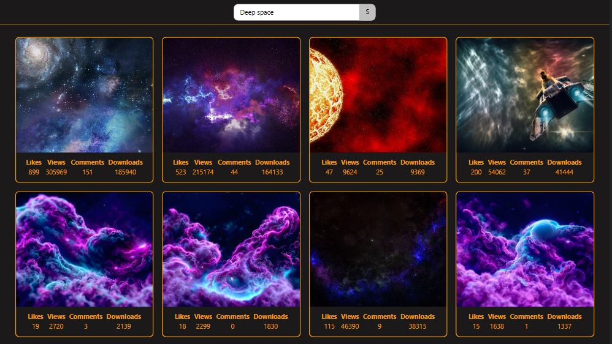
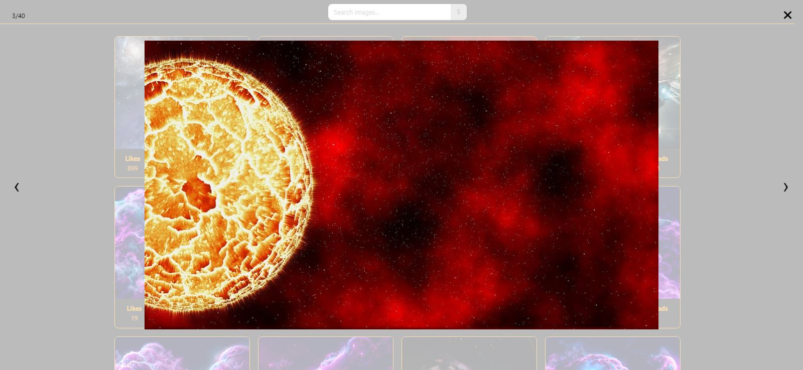

<h1 align="center">ImageFinder</h1>

<h2>About project</h2>

This web application allows you to find images by keywords. Image search is done using the <a href="https://pixabay.com/service/about/api/" target="_blank" rel="noopener noreferrer nofollow">Pixabay API</a>.

<h2>Features</h2>
<ul>
  <li>
    <h3>Image search</h3>
    
  </li>
  <li>
    <h3>View the selected image</h3>
    
  </li>
</ul>

<h2>Technology stack</h2>

